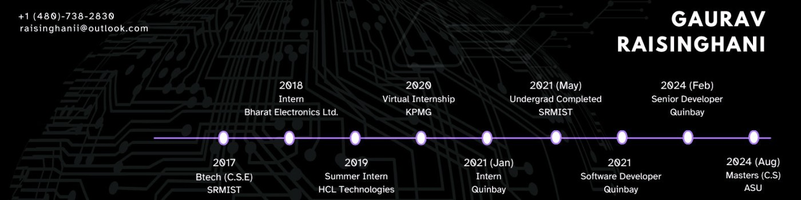

<!-- ======================= HERO ======================= -->

  

  

<!-- ======================= SOCIALS ======================= -->

  
  &nbsp;&nbsp;
  
  &nbsp;&nbsp;
  

---

## 🧠 About Me
I’m a **Senior Software Engineer** and **MS Computer Science** student at **Arizona State University (GPA 3.95 / 4)** with 3 + years of experience building **scalable microservices**, **event-driven systems**, and **AI-powered observability**.

💡 I specialize in **Spring Boot**, **Kafka**, **Kubernetes**, and **AWS** — building intelligent, high-performance architectures.

**Focus Areas**  
☁️ Cloud Infrastructure 🔁 Microservices Architecture 📈 Observability & Metrics 🧠 AI for Systems

---

## ⚙️ Tech Stack

  

---

## 🚀 Featured Projects
| Project | Description | Stack |
|----------|--------------|--------|
| **ObservaAI** | AI-powered Kubernetes observability & visualization platform | Spring Boot · Kafka · Grafana |
| **Spring Cloud Gateway TMS** | API Gateway with JWT filters and rate limiting | Spring Cloud · Redis · AWS |
| **Rich Results SSR Engine** | SEO microservice using SSR & schema automation | Spring Boot · JSON-LD |
| **Privacy-Preserving Analytics** | Encrypted analytics via federated learning | Kafka · AES-256 · Python |
| **Interactive D3 Visuals** | Data visualization for dynamic dashboards | D3.js · HTML · CSS |

---

## 📊 Live GitHub Metrics

  
  

  

  

  

---

## ✍️ Top Articles
- 🧩 [Implementing Spring Cloud Gateway — A Comprehensive Guide](https://medium.com/@gauravraisinghani1998)
- 📊 [Transforming Data into Dynamic Narratives with D3.js](https://medium.com/@gauravraisinghani1998)
- 🔐 [Privacy-Preserving Health Insurance Analytics](https://medium.com/@gauravraisinghani1998)
- 💡 [Is P = NP? The Million-Dollar Question Reshaping Computer Science](https://medium.com/@gauravraisinghani1998)

## 📰 Latest Articles (auto-updated)
<!-- BLOG-POST-LIST:START -->
- [Is Dijkstra’s Algorithm Finally Broken? The 2025 Breakthrough That Redefines Shortest Paths](https://medium.com/@gauravraisinghani1998/is-dijkstras-algorithm-finally-broken-the-2025-breakthrough-that-redefines-shortest-paths-60eed0ad0c58?source=rss-76a6b0804371------2)
- [Unlocking Privacy &amp; Intelligence in Health Insurance Analytics with Homomorphic Encryption and AI](https://medium.com/@gauravraisinghani1998/unlocking-privacy-intelligence-in-health-insurance-analytics-with-homomorphic-encryption-and-ai-0a5b665d7f35?source=rss-76a6b0804371------2)
- [✨ Transforming Data into Dynamic Narratives with D3.js](https://medium.com/@gauravraisinghani1998/transforming-data-into-dynamic-narratives-with-d3-js-78496bdd18c9?source=rss-76a6b0804371------2)
- [From Guesswork to Ground Truth: The Planning Poker 2.0 Revolution](https://medium.com/@gauravraisinghani1998/from-guesswork-to-ground-truth-the-planning-poker-2-0-revolution-bde9e8d07d38?source=rss-76a6b0804371------2)
- [The Onboarding Paradox: Are We Learning or Just Following Tradition?](https://medium.com/@gauravraisinghani1998/the-onboarding-paradox-are-we-learning-or-just-following-tradition-96d0b77ca2f6?source=rss-76a6b0804371------2)
<!-- BLOG-POST-LIST:END -->

---

## 🎯 Current Focus
- 🧠 Building **ObservaAI** (public v2 demo + docs)  
- ☁️ Scaling microservices with Spring Cloud & K8s  
- ✍️ Writing on AI for DevOps and observability patterns  

---

## 🪄 Connect

  
  &nbsp;&nbsp;
  
  &nbsp;&nbsp;
  

---

### 🧭 Motto
> “Code that scales, systems that learn, and solutions that last.” ✨
